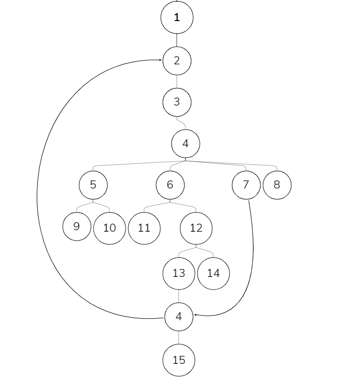
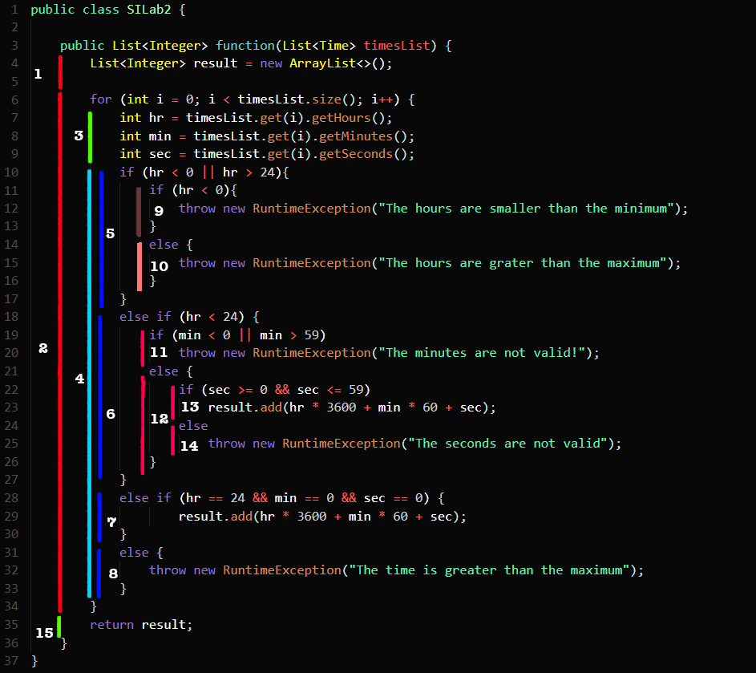

# Горан Исајлоски - 183213

## Лабараторсика вежба 2

###  Control Flow Graph


 

### Every branch критериум. 

   ```
   @Test
   public void test1() {
       //Testing branch 1,2,3,4,5,9
       Time object = new Time(-99,0,0);
       List<Time> timeList = new ArrayList<>();
       timeList.add(object);
       try {
           SILab2.function(timeList );
       } catch (Exception e){
           assertEquals(e.getMessage(),"The hours are smaller than the minimum");
       }
   }
   
   @Test
   public void test2() {
       //Testing branch 1,2,3,4,5,10
       Time object = new Time(26,0,0);
       List<Time> timeList = new ArrayList<>();
       timeList.add(object);
       try {
           SILab2.function(timeList );
       } catch (Exception e){
           assertEquals(e.getMessage(),"The hours are greater than the maximum");
       }
   }
   
   @Test
   public void test3() {
       //Testing branch 1,2,3,4,6,11
       Time object = new Time(26,-30,0);
       List<Time> timeList = new ArrayList<>();
       timeList.add(object);
       try {
           SILab2.function(timeList );
       } catch (Exception e){
           assertEquals(e.getMessage(),"The minutes are not valid");
       }
   }
   
   @Test
   public void test4() {
       //Testing branch 1,2,3,4,6,12,13,4,15
       Time object = new Time(13,30,0);
       List<Time> timeList = new ArrayList<>();
       timeList .add(time);
       List<Integer> result = new ArrayList<>();
       timeList.add(object);
       result = SILab2.function(timeList);
       assertEquals(result.get(0).intValue().time.getHours()*3600 + time.getMinutes()*60 + time.getSeconds());
   }
   
   @Test
   public void test5() {
       //Testing branch 1,2,3,4,6,14
       Time object = new Time(13,30,0);
       List<Time> timeList = new ArrayList<>();
       timeList.add(object);
       try {
           SILab2.function(timeList );
       } catch (Exception e){
           assertEquals(e.getMessage(),"The seconds are not valid");
       }
   }
   
   public void test6() {
       //Testing branch 1,2,3,4,7,4,15
       Time object = new Time(24,0,0);
       List<Time> timeList = new ArrayList<>();
       timeList.add(object);
       List<Integer> result = new ArrayList<>();
       result = SILab2.function(timeList);
       assertEquals(result.get(0).intValue().time.getHours()*3600 + time.getMinutes()*60 + time.getSeconds());
   }
   
   public void test7() {
       //Testing branch 1,2,3,4,8
       Time object = new Time(24,3,2);
       List<Time> timeList = new ArrayList<>();
       timeList.add(object);
       try {
           SILab2.function(timeList );
       } catch (Exception e){
           assertEquals(e.getMessage(),"The time is greater than the maximum");
       }
   }
   
   ```


#### Објаснување на тестовите. 

Тест 1, проверуваме дали внесенеиот час е негативен број, доколку е негативен тогаш поминува овој тест и стигнуваме до темето 9.

Тест 2, проверуваме дали внесенеиот час е поголем од бројот 24 бидејќи не постои таков број во 24часовен систем, ова ќе ни го даде темето 10.

Тест 3. проверуваме дали внесенеиот час е валиден односно дадениот бројот е помеѓу [0 и 24] но при тоа внесените минути се невалидни тогаш го добиваме темето  11.

Тест 4. проверуваме дали внесениот час е валдиен односно е помеѓу [0 и 24] при тоа дадените минути се  валдини [0,60] за овој тест треба да го добиеме темето 15

Тест 5.  проверуваме дали внесениот час е валдиен односно дали е помеѓу [0 и 24] при тоа дадените минути и секунди се валидни. Тогаш го добиваме темето 15 поминувајќи низ 13.

Тест 6. провруваме дали часто е точно 24, дали минутите и секунди се еднакви на 0. тогаш го добиваме темето 15 поминвајќи на 7.

Тест. 7. Доколкку часот е точно 24, минутите и секнудните не се 0 тогаш го добиваме темето 8.

### Every path

Бидејќи се работи за патеки, но при тоа имаме циклус во нашипт год, тогаш бројот на патеки е бесонечен. Па затоа ќе дадам само еден примери за патеки.

```
public void test1() {
    //PATH Test
    //Testing path 
    Time time = new Time(13,30,0);
    Time time1 = new Time(14,30,0);
    Time time2 = new Time(15,30,0);
    List<Time> timesList = new ArrayList<>();
    List<Integer> result = new ArrayList<>();
    timesList.add(time);
    timesList.add(time1);
    timesList.add(time2);
    result = SILab2.function(timesList);
    assertEquals(result.get(0).intValue().time.getHours()*3600 + time.getMinutes()*60 + time.getSeconds());
    assertEquals(result.get(1).intValue().time.getHours()*3600 + time.getMinutes()*60 + time.getSeconds());
    assertEquals(result.get(2).intValue().time.getHours()*3600 + time.getMinutes()*60 + time.getSeconds());

   
   
}
```
#### Објаснување на тестовите
За овој тест ја изминуваме патеката 1,2,3,4,6,12,13,4,2,3,4,6,12,13,4,2,3,4,6,12,13,4,15. Прво проверува за првиот пример, па за вториот, па за третиот итн.
